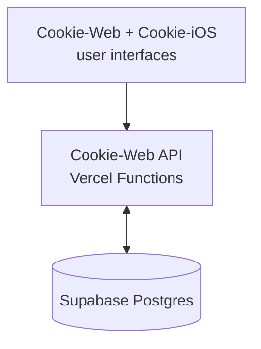
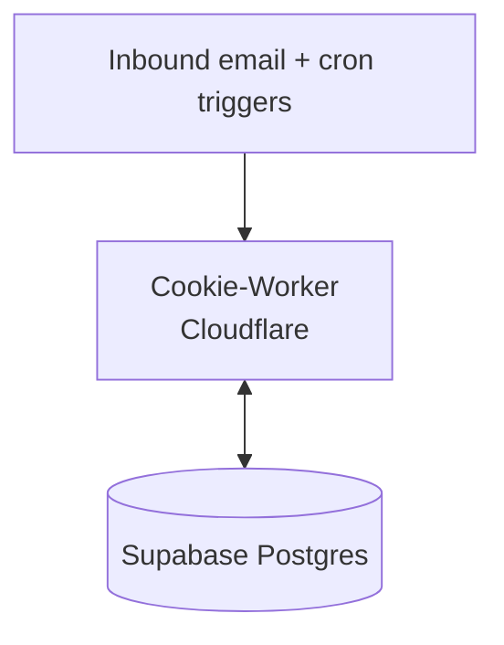
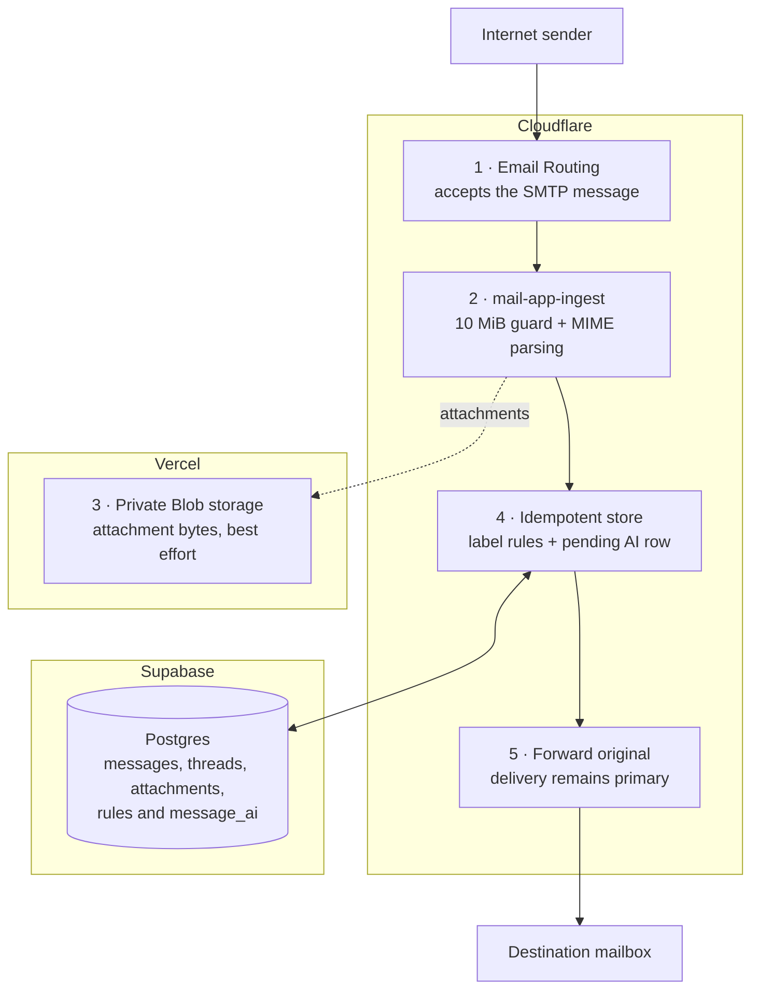
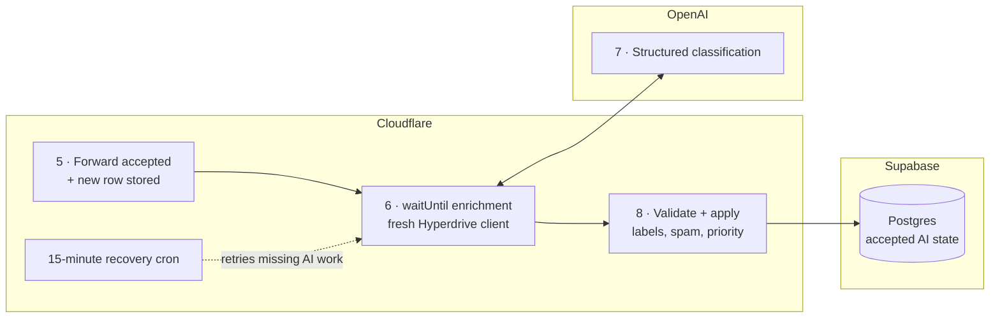
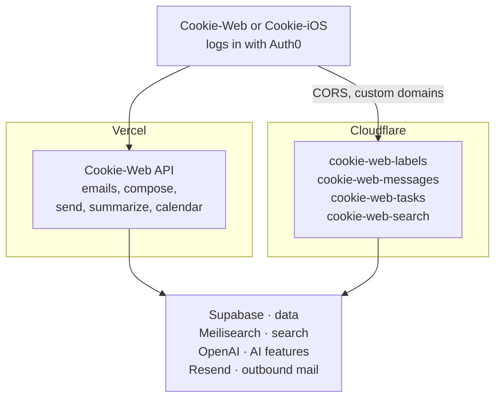
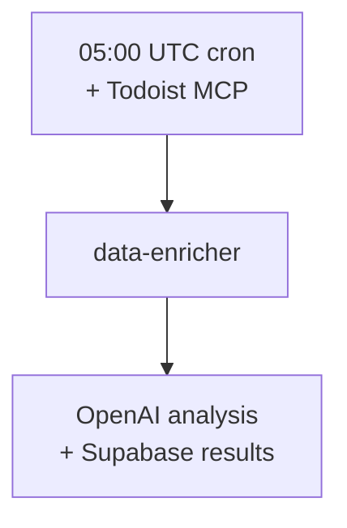
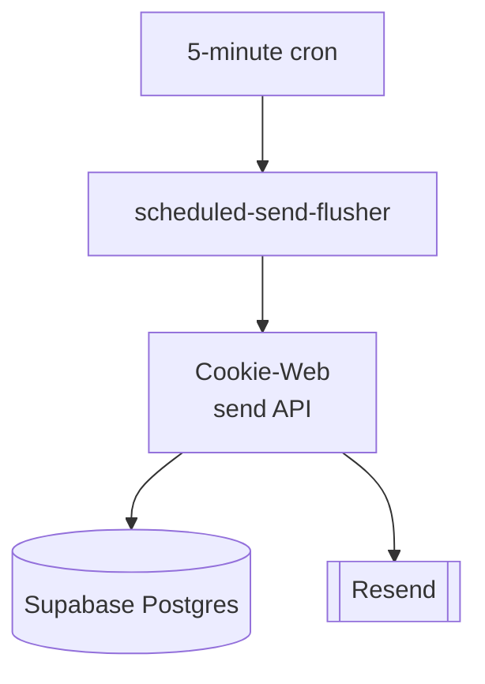

Cookie has three runtime repositories that share one database, plus a documentation repository:

- **Cookie-Web** owns the shared schema (`migrations/` lives there) and serves both the browser app and the Vercel API that Cookie-iOS also calls.
- **Cookie-Worker** owns everything that runs outside a request/response cycle: inbound mail ingestion, overnight AI enrichment, and a scheduled-send flusher.
- **Cookie-iOS** is a native client of the Cookie-Web API — it owns no server-side logic or data of its own.
- **Cookie-Docs** builds this static Blume/MDX site and deploys it to GitHub Pages — it is not on any mail or app request path.

:::note
Cookie-Web and Cookie-Worker are deployed and versioned independently, but a change to one is not safe in isolation when it touches shared state — see [migration coordination](/data-model#coordinating-with-cookie-worker) in the data model page.
:::

## System overview

**App requests:**

**Worker processing:**

The overview shows ownership and shared state only. External services appear in the focused flows below, where their role is easier to follow.

## What runs where

Cookie's server-side code is split across two providers. The split is historical
rather than principled: everything began as Vercel Functions, and the routes
that needed Cloudflare's edge — or that were being rewritten anyway — moved to
Workers one at a time. Both halves talk to the same Supabase database.

| Runtime | Provider | What it serves |
| --- | --- | --- |
| Static SPA + 7 Functions | **Vercel** | `mail.infinitywave.online` — the Vue app, plus `api/`: `emails`, `compose`, `send`, `summarize`, `calendar-events`, `read-receipts`, `notification-event` |
| Private Blob storage | **Vercel** | Attachment bytes written by `mail-app-ingest` |
| `cookie-web-labels` | **Cloudflare** | `labels-api.infinitywave.online` — labels and label rules |
| `cookie-web-messages` | **Cloudflare** | `messages-api.infinitywave.online` — single-message read/state/unsubscribe, attachments, contacts |
| `cookie-web-tasks` | **Cloudflare** | `tasks-api.infinitywave.online` — AI Today cards and the Documents store |
| `cookie-web-search` | **Cloudflare** | `search-api.infinitywave.online` — hybrid search over mail and documents (`GET /search`) and mailbox Q&A (`POST /ask`), both backed by Meilisearch |
| `mail-app-ingest` | **Cloudflare** | Email Worker on inbound mail (+ a 15-minute recovery cron) |
| `data-enricher` | **Cloudflare** | Cron at 05:00 UTC, plus on-demand `POST /run` |
| `scheduled-send-flusher` | **Cloudflare** | Cron every 5 minutes |

:::note
The three `cookie-web-*` Workers used to be Vercel Functions (`api/labels.js`,
`api/messages.js`, `api/tasks.js`). The paths kept their names through the move,
so `/messages` on the Worker is the same endpoint the SPA has always called —
only the origin changed. Anything still under `api/` in Cookie-Web is Vercel.
:::

## Three request flows

### 1. Inbound mail

Cloudflare Email Routing invokes the `mail-app-ingest` Worker on every message addressed to the domain. The delivery path and the optional AI work are shown separately so each provider boundary stays readable.

**Delivery and durable storage:**

**Best-effort work after delivery:**

All parsing, orchestration, deterministic label rules, forwarding, and post-delivery policy checks run in the Cloudflare Worker. Supabase holds relational message state through Hyperdrive; Vercel is involved only through private Blob storage for attachment bytes—Vercel Functions are not on the inbound path. OpenAI returns structured classification results, but Cookie-Worker applies the local thresholds before writing the accepted outcome.

Forwarding to the real mailbox is the primary outcome — storage, attachment upload, AI classification, and monitoring failures never intentionally block delivery. Transient forwarding errors are re-thrown so the sending server retries; permanent forwarding errors are only accepted once the message is stored safely. A 15-minute cron sweeps up to three stale pending/failed AI rows for recovery, without forwarding the message again. See [Cookie-Worker → mail-app-ingest](/components/cookie-worker#mail-app-ingest).

### 2. Interactive app traffic

The browser and iOS app never talk to Postgres directly. Both authenticate with Auth0, then call two sets of endpoints with the same bearer token — Cookie-Web's Vercel functions, and four Cloudflare Workers the browser reaches cross-origin:

Both halves verify the token the same way: the verified Auth0 issuer + immutable `sub` bind to `users.auth0_sub`, and token email claims never select a mailbox. The difference is only that the Workers are a cross-origin hop, so they also run a CORS allowlist and Cookie-Web's CSP must permit `https://*.infinitywave.online` in `connect-src`. See [Cookie-Web](/components/cookie-web) and [Cookie-Worker → Cookie Web API Workers](/components/cookie-worker#cookie-web-api-workers).

### 3. Scheduled background work

Cloudflare cron triggers drive the work that has no human waiting on a response. Two of them do the work below; a third, `mail-app-ingest`'s 15-minute sweep, retries stale AI enrichment and is covered in the inbound-mail flow above.

**Daily enrichment:**

**Scheduled sending:**

- **`data-enricher`** runs daily at 05:00 UTC (plus on-demand via `POST /run`). It gathers Todoist tasks, runs AI task analysis over important mail, triages the last 24 hours of Inbox mail, and assembles the personalised news round-up — all written to Postgres and read by Cookie-Web's AI Today page through the `cookie-web-tasks` Worker.
- **`scheduled-send-flusher`** runs every 5 minutes and calls `POST /api/send?resource=flush` on Cookie-Web so "Send Later" messages actually go out once due. It owns no mail-sending logic itself — Cookie-Web claims the due rows and calls Resend.

See [Cookie-Worker → data-enricher and scheduled-send-flusher](/components/cookie-worker) for both.

## Shared state, not shared code

Cookie-Web and Cookie-Worker are separate deployables that coordinate purely through the Postgres schema: Cookie-Web defines and applies migrations; Cookie-Worker's `mail-app-ingest` and `data-enricher` read and write the same tables through a Hyperdrive-proxied connection. There is no RPC or shared library between the two runtimes — a Worker capsule only gains access to another Worker's code once at least two Workers actually need it (see [Cookie-Worker](/components/cookie-worker)).
