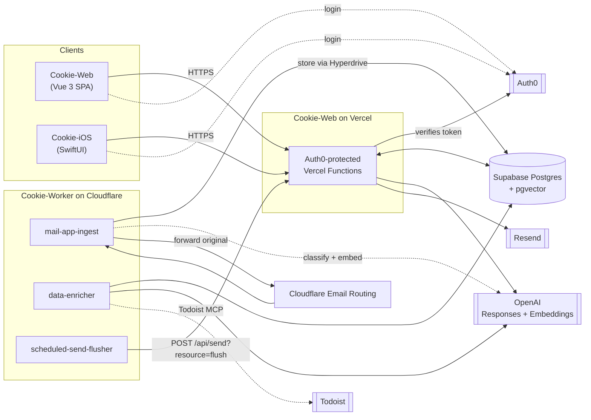

Cookie is split across three repositories that share one database:

- **Cookie-Web** owns the shared schema (`migrations/` lives there) and serves both the browser app and the Vercel API that Cookie-iOS also calls.
- **Cookie-Worker** owns everything that runs outside a request/response cycle: inbound mail ingestion, overnight AI enrichment, and a scheduled-send flusher.
- **Cookie-iOS** is a native client of the Cookie-Web API — it owns no server-side logic or data of its own.

:::note
Cookie-Web and Cookie-Worker are deployed and versioned independently, but a change to one is not safe in isolation when it touches shared state — see [migration coordination](/data-model#coordinating-with-cookie-worker) in the data model page.
:::

## System overview



## Three request flows

### 1. Inbound mail

Cloudflare Email Routing invokes the `mail-app-ingest` Worker on every message addressed to the domain:

```text
Cloudflare Email Routing
  -> parse MIME
  -> store idempotently through Hyperdrive (+ apply matching label rules)
  -> forward original email
  -> close ingest database client
  -> waitUntil(AI classification + embedding on a fresh client)
```

Forwarding to the real mailbox is the primary outcome — storage, AI classification, embedding, and monitoring failures never intentionally block delivery. Transient forwarding errors are re-thrown so the sending server retries; permanent forwarding errors are only accepted once the message is stored safely. A 15-minute cron sweeps up to three stale pending/failed AI rows for recovery. See [Cookie-Worker → mail-app-ingest](/components/cookie-worker#mail-app-ingest).

### 2. Interactive app traffic

The browser and iOS app never talk to Postgres directly. Both authenticate with Auth0 and call the same Vercel functions in Cookie-Web:

```text
Vue 3 / SwiftUI client
  -> Auth0-protected Vercel Function (api/*.js)
       -> Supabase Postgres + pgvector (inbox, labels, search, calendar, documents...)
       -> OpenAI Responses/Embeddings APIs (search, ask, compose)
       -> Resend (outbound send)
```

Every function binds the verified Auth0 issuer + immutable `sub` to `users.auth0_sub` — token email claims never select a mailbox. See [Cookie-Web](/components/cookie-web).

### 3. Scheduled background work

Two Cloudflare cron triggers drive work that has no human waiting on a response:

- **`data-enricher`** runs daily at 05:00 UTC (plus on-demand via `POST /run`). It gathers Todoist tasks, runs AI task analysis over important mail, builds the unread-mail digest, and assembles the personalised news round-up — all written to Postgres and read by Cookie-Web's AI Today page through `/api/tasks`.
- **`scheduled-send-flusher`** runs every 5 minutes and calls `POST /api/send?resource=flush` on Cookie-Web so "Send Later" messages actually go out once due. It owns no mail-sending logic itself — Cookie-Web claims the due rows and calls Resend.

See [Cookie-Worker → data-enricher and scheduled-send-flusher](/components/cookie-worker) for both.

## Shared state, not shared code

Cookie-Web and Cookie-Worker are separate deployables that coordinate purely through the Postgres schema: Cookie-Web defines and applies migrations; Cookie-Worker's `mail-app-ingest` and `data-enricher` read and write the same tables through a Hyperdrive-proxied connection. There is no RPC or shared library between the two runtimes — a Worker capsule only gains access to another Worker's code once at least two Workers actually need it (see [Cookie-Worker](/components/cookie-worker)).
