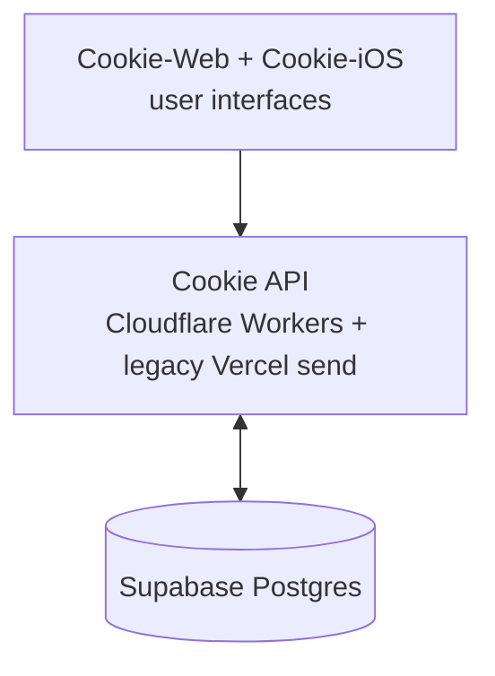
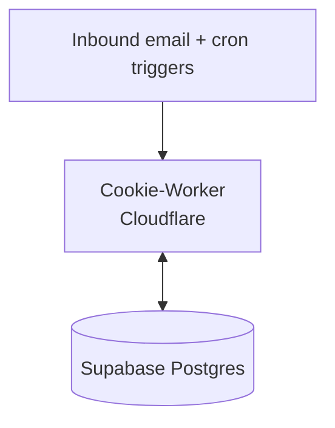
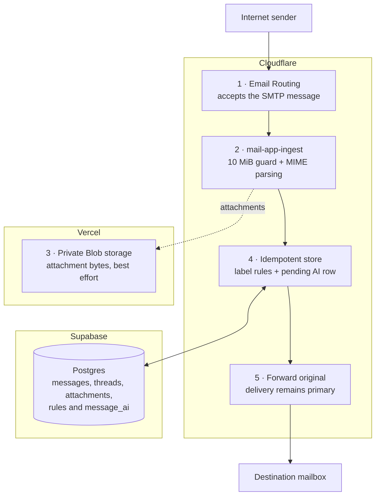
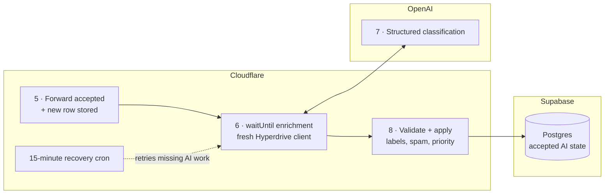
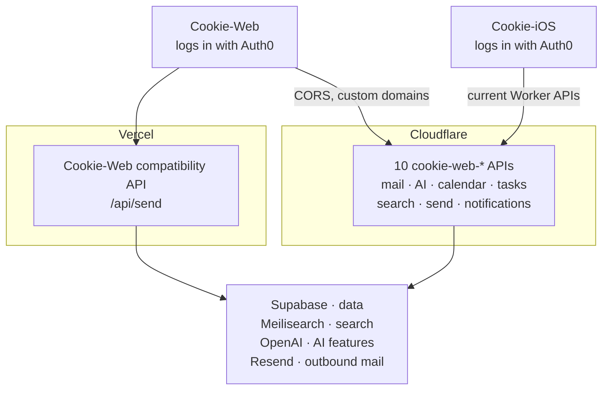
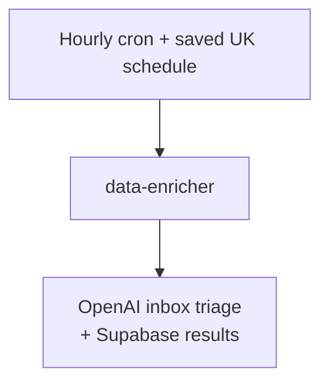
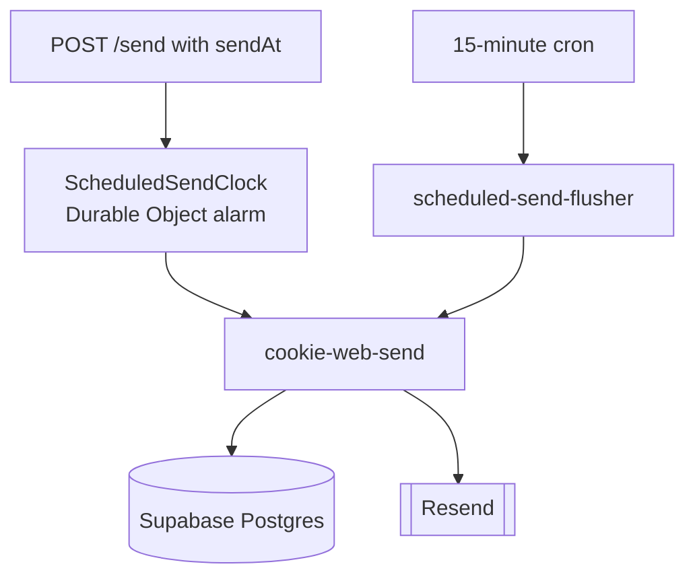

The Cookie mail application has three runtime repositories that share one database, plus a documentation repository. Cookie-Agents is a fifth, separate runtime with its own database:

- **Cookie-Web** owns the shared schema (`migrations/` lives there), serves the browser SPA from Vercel, and retains the legacy `/api/send` compatibility endpoint.
- **Cookie-Worker** owns ten browser/API Workers and three background Workers: inbound mail ingestion, overnight AI enrichment, and the scheduled-send clock.
- **Cookie-iOS** is a native client of the Cookie-Web API — it owns no server-side logic or data of its own.
- **Cookie-Docs** builds this static Blume/MDX site and deploys it to GitHub Pages — it is not on any mail or app request path.
- **Cookie-Agents** collects Gmail and Todoist data through FastAPI on Render. It neither calls nor shares data with the Cookie mail application.

:::note
Cookie-Web and Cookie-Worker are deployed and versioned independently, but a change to one is not safe in isolation when it touches shared state — see [migration coordination](/data-model#coordinating-with-cookie-worker) in the data model page.
:::

## System overview

**App requests:**

**Worker processing:**

The overview shows ownership and shared state only. External services appear in the focused flows below, where their role is easier to follow.

**Interactive version:** [system overview diagram](/Cookie-Docs/diagrams/system-overview.html) — pan, zoom, guided views, and export.

## What runs where

Cookie's mail-app server-side code is split across two providers. The Vue SPA
and compatibility `/api/send` route remain on Vercel; the active APIs have
moved to Cloudflare Workers one route family at a time. Both halves talk to the
same Supabase database.

| Runtime | Provider | What it serves |
| --- | --- | --- |
| Static SPA + legacy send | **Vercel** | `mail.infinitywave.online` — the Vue app and `/api/send`, still used by the current web client |
| Private Blob storage | **Vercel** | Attachment bytes written by `mail-app-ingest` |
| `cookie-web-ai` | **Cloudflare** | `ai-api.infinitywave.online` — compose and thread summaries |
| `cookie-web-calendar` | **Cloudflare** | `calendar-api.infinitywave.online` — calendars, events, ICS sync, and natural-language event drafts |
| `cookie-web-emails` | **Cloudflare** | `emails-api.infinitywave.online` — mailbox lists and lightweight app state |
| `cookie-web-labels` | **Cloudflare** | `labels-api.infinitywave.online` — labels and label rules |
| `cookie-web-messages` | **Cloudflare** | `messages-api.infinitywave.online` — single-message read/state/unsubscribe, attachments, contacts |
| `cookie-web-notifications` | **Cloudflare** | `notifications-api.infinitywave.online` — browser-notification event claim/ack |
| `cookie-web-receipts` | **Cloudflare** | `receipts-api.infinitywave.online` — tracking pixel and authenticated receipt status |
| `cookie-web-search` | **Cloudflare** | `search-api.infinitywave.online` — federated hybrid search and mailbox Q&A |
| `cookie-web-send` | **Cloudflare** | `send-api.infinitywave.online` — outbound/scheduled delivery; used by Cookie-iOS and the flusher service binding while Cookie-Web retains its Vercel compatibility call |
| `cookie-web-tasks` | **Cloudflare** | `tasks-api.infinitywave.online` — AI Today, Tasks, projects, and Documents |
| `mail-app-ingest` | **Cloudflare** | Email Worker on inbound mail (+ a 15-minute recovery cron) |
| `data-enricher` | **Cloudflare** | Hourly cron gated by the saved Europe/London schedule, plus on-demand `POST /run` |
| `scheduled-send-flusher` | **Cloudflare** | Cron every 15 minutes, safety net behind the `ScheduledSendClock` alarm |
| Cookie-Agents API + database | **Render** | Separate Gmail/Todoist collector; not connected to the mail-app schema |

:::note
The ten browser-facing `cookie-web-*` Workers replace the former Vercel route
families. Most replace `?resource=` multiplexing with clean paths such as
`/emails/state`, `/send/scheduled`, and `/tasks/refresh`. Cookie-Web still keeps
`api/send.js` as a compatibility path for its current clients.
:::

## Three request flows

### 1. Inbound mail

Cloudflare Email Routing invokes the `mail-app-ingest` Worker on every message addressed to the domain. The delivery path and the optional AI work are shown separately so each provider boundary stays readable.

**Delivery and durable storage:**

**Best-effort work after delivery:**

All parsing, orchestration, deterministic label rules, forwarding, and post-delivery policy checks run in the Cloudflare Worker. Supabase holds relational message state through Hyperdrive; Vercel is involved only through private Blob storage for attachment bytes—Vercel Functions are not on the inbound path. OpenAI returns structured classification results, but Cookie-Worker applies the local thresholds before writing the accepted outcome.

Forwarding to the real mailbox is the primary outcome — storage, attachment upload, AI classification, and monitoring failures never intentionally block delivery. Transient forwarding errors are re-thrown so the sending server retries; permanent forwarding errors are only accepted once the message is stored safely. A 15-minute cron sweeps up to three stale pending/failed AI rows for recovery, without forwarding the message again. See [Cookie-Worker → mail-app-ingest](/components/cookie-worker#mail-app-ingest).

**Interactive version:** [inbound mail flow diagram](/Cookie-Docs/diagrams/inbound-mail.html) — both halves of the flow on one swim-lane canvas.

### 2. Interactive app traffic

The browser and iOS app never talk to Postgres directly. Both authenticate with Auth0 and call the Cloudflare APIs; Cookie-iOS uses the current Worker origins and clean route paths throughout, while the browser still uses Vercel's compatibility send route:

Both halves verify the token the same way: the verified Auth0 issuer + immutable `sub` bind to `users.auth0_sub`, and token email claims never select a mailbox. The difference is only that the Workers are a cross-origin hop, so they also run a CORS allowlist and Cookie-Web's CSP must permit `https://*.infinitywave.online` in `connect-src`. See [Cookie-Web](/components/cookie-web) and [Cookie-Worker → Cookie Web API Workers](/components/cookie-worker#cookie-web-api-workers).

**Interactive version:** [interactive app traffic diagram](/Cookie-Docs/diagrams/interactive-app.html) — the Worker API groups and their backing services.

### 3. Scheduled background work

Cloudflare cron triggers drive the work that has no human waiting on a response. Two of them do the work below; a third, `mail-app-ingest`'s 15-minute sweep, retries stale AI enrichment and is covered in the inbound-mail flow above.

**Scheduled email triage:**

**Scheduled sending:**

- **`data-enricher`** runs inbox triage only, using an hourly cron gated by the owner-configured Europe/London schedule (default daily, 09:00–19:00 inclusive), plus on-demand `POST /run`. It triages the last 24 hours of Inbox mail and stores the result in Postgres for AI Today through `cookie-web-tasks`. News generation and per-email task extraction are disabled; existing stored results remain readable.
- **On-time delivery** is the `ScheduledSendClock` Durable Object inside `cookie-web-send`: queuing a send arms its single alarm for the earliest pending time, and when it fires the same claim-and-deliver code the flush route uses runs, then re-arms from the next pending send.
- **`scheduled-send-flusher`** is the safety net behind that alarm. It runs every 15 minutes and calls `POST /send/flush` on `cookie-web-send` over a Cloudflare service binding, which picks up retries, expired leases and anything a lost alarm missed, and runs the housekeeping sweeps. It owns no mail-sending logic itself — `cookie-web-send` claims the due rows and calls Resend.

See [Cookie-Worker → data-enricher and scheduled-send-flusher](/components/cookie-worker) for both.

**Interactive version:** [scheduled background work diagram](/Cookie-Docs/diagrams/scheduled-work.html) — both cron flows side by side.

## Shared state, not shared code

Cookie-Web and Cookie-Worker are separate deployables that coordinate primarily through the Postgres schema: Cookie-Web defines and applies migrations, while Workers read and write the same tables through Hyperdrive. Two narrow Worker-to-Worker calls use Cloudflare service bindings: `cookie-web-tasks` triggers `data-enricher`, and `scheduled-send-flusher` calls `cookie-web-send`. Cookie-Agents remains outside both paths with its own Render PostgreSQL database.
