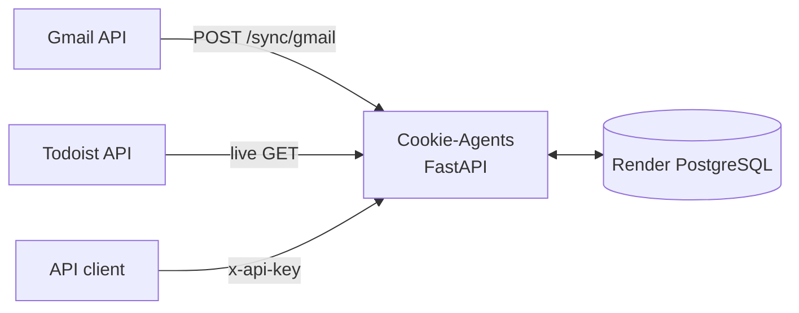

Cookie-Agents is a small productivity data-collection API. It syncs Gmail threads and messages into its own PostgreSQL database and proxies Todoist tasks live. Despite the shared Cookie name, it is **not** part of the Cookie mail application's runtime: Cookie-Web, Cookie-Worker, and Cookie-iOS do not call it, and it does not use their Supabase schema.

The earlier AI-priority pipeline was removed. The repository now contains only the collection and read API described here.

## Request flow



- Gmail sync is on demand and also triggered by Render cron services. Threads and messages are upserted into PostgreSQL.
- Todoist tasks are fetched on every request and are not stored.
- Every endpoint except `/health` requires the shared `x-api-key` secret.

## API surface

| Method | Path | Purpose |
| --- | --- | --- |
| `GET` | `/health` | Liveness and database-connectivity check; the only unauthenticated route |
| `POST` | `/sync/gmail` | Sync recent Gmail inbox threads into the service database |
| `GET` | `/data/emails` | List stored email records, optionally filtered by `requires_reply` |
| `GET` | `/data/emails/{thread_id}` | Read one stored Gmail thread |
| `GET` | `/data/tasks` | Proxy live Todoist tasks; returns an empty list when no token is configured |

FastAPI serves Swagger UI at `/docs` and the OpenAPI document at `/openapi.json`. The repository also publishes a static ReDoc page from its `docs/` directory.

## Technology and layout

| Area | Technology |
| --- | --- |
| API | FastAPI, Pydantic, Uvicorn |
| Data access | SQLAlchemy, Alembic, asyncpg/psycopg |
| Database | PostgreSQL 18 (local Compose or managed Render PostgreSQL) |
| Integrations | Gmail OAuth/API, Todoist REST API |
| Deployment | Docker image and Render Blueprint |
| Observability | Structlog and OpenTelemetry |

<FileTree>

- app/
  - api/ — API-key authentication, health, sync, and data routes
  - db/ — SQLAlchemy models and database sessions
  - services/ — Gmail synchronization and stored-email queries
  - observability/ — structured logging and tracing
- alembic/ — service-owned migrations
- scripts/ — Gmail OAuth and scheduled-sync helpers
- docker-compose.yml — local API and PostgreSQL stack
- render.yaml — production API, database, and cron services

</FileTree>

## Local development

Docker Compose is the supported setup because it supplies both the API and PostgreSQL:

```sh
cp .env.example .env
docker compose up -d --build
curl http://localhost:8000/health
```

Gmail and Todoist credentials are optional. `API_KEY` is required for authenticated routes. Alembic migrations run when the API container starts.

## Deployment boundary

Render provisions `cookie-agents-api`, `cookie-agents-db`, and cron services that call `/sync/gmail`. Pushes to `main` auto-deploy the service. Its API key, Gmail OAuth credentials, and optional Todoist token live in a Render environment group.

:::note
Cookie-Agents' PostgreSQL tables (`source_objects`, `email_threads`, and `emails`) are unrelated to the [Cookie mail data model](/data-model). Changes here do not require Cookie-Web migrations or Cookie-Worker coordination.
:::
