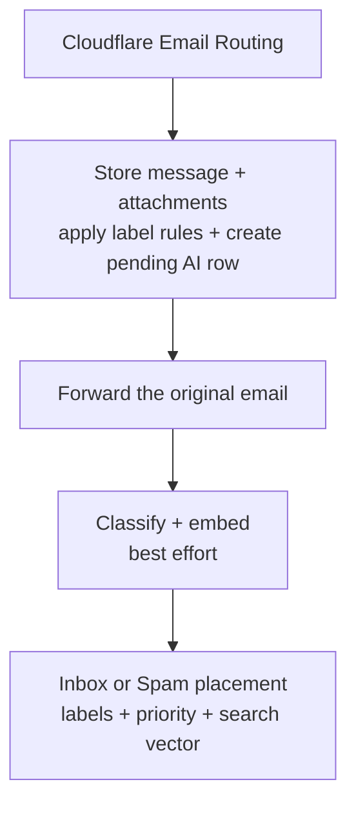

Cookie's AI features are deliberately narrow: each one assists a specific, familiar task rather than acting autonomously on the user's behalf. The full design rationale lives in Cookie-Web's `docs/AI-CAPABILITIES-REPORT.md`; this page explains what's shipped and how the pieces work together.

| Capability | Component | Model/API |
| --- | --- | --- |
| Auto-tagging | `mail-app-ingest` (Cookie-Worker) | OpenAI structured response |
| Spam detection | `mail-app-ingest` (Cookie-Worker) | Same structured response as auto-tagging |
| Semantic search & embeddings | `mail-app-ingest` (write) / `api/search` (read) | `text-embedding-3-small` |
| Mailbox Q&A | `api/ask` (Cookie-Web) | OpenAI Responses API |
| AI Compose | `api/compose` (Cookie-Web) | OpenAI Responses API |
| Reading-view summaries | `api/summarize` (Cookie-Web) | OpenAI Responses API |
| AI Today: task extraction, digest, news | `data-enricher` (Cookie-Worker) | OpenAI Responses API |

## What “AI Inbox” means

AI Inbox is Cookie's normal mailbox with assistance layered around it — not a second mailbox and not an autonomous email agent. New inbound mail is classified and embedded automatically; summaries, mailbox Q&A, and draft generation run only when the user asks for them. Nothing in the AI path replies, sends, or deletes mail by itself.

| When | What runs | Result |
| --- | --- | --- |
| When mail arrives | Deterministic label rules, AI classification, spam scoring, priority, and an embedding | Labels and Spam placement update; the message becomes available to semantic search |
| When the user asks | Semantic search, mailbox Q&A, a thread summary, or AI Compose | A result or draft is returned to the authenticated client |
| Daily or on refresh | AI Today enrichment | Important-email tasks, unread digest, and personalised news are stored for the AI Today page |

## What happens when mail arrives

### 1. Store first, with deterministic rules

`mail-app-ingest` parses the message and stores it idempotently through Hyperdrive. The same database transaction creates a durable `message_ai` row with `status = 'pending'` and evaluates the user's enabled label rules.

Rules are deliberately separate from AI: they compare `subject`, `body`, `from`, or `to` using exact `contains`, `equals`, `starts_with`, or `ends_with` conditions. A matching rule writes a label with `source = 'rule'`; because this happens inside the storage transaction, there is no confidence threshold or recovery job.

The original email is then forwarded to the real mailbox. Delivery is the primary outcome: storage, attachment upload, AI, and monitoring failures never intentionally make the model a dependency of forwarding.

### 2. Classify and embed in parallel

Best-effort enrichment uses a fresh database client rather than holding the ingest connection open during model latency. Classification and embedding requests run concurrently, but each result is saved independently so one successful result survives if the other request fails.

The classification request contains:

- the sender address, subject, and up to **12,000 characters** of plain-text body;
- only user labels whose **Auto-tag** switch is enabled, including each label's ID, name, and description;
- a system instruction that treats the email as untrusted data, never as instructions.

The OpenAI response is constrained to a strict JSON schema containing candidate label IDs and confidences, a spam verdict/score/reason, and a `low`/`normal`/`high` priority. The default model is `gpt-5.6-luna` (overridable with `AI_MODEL`), and the stored prompt version is `email-enrichment-v2`.

At the same time, Cookie embeds the subject plus up to **8,000 characters** of body with `text-embedding-3-small`, producing the 1,536-dimension vector used by semantic search.

:::note
Arrival-time enrichment never generates a message summary. Reading-view summaries are a separate, authenticated, user-triggered operation.
:::

### 3. Apply local policy after the model responds

Cookie-Worker does not write the model response directly. It applies deterministic checks first:

| Model output | Local decision | Effect |
| --- | --- | --- |
| Label candidates | Keep only IDs offered to the model with confidence **≥ 0.70** | Replace prior `source = 'ai'` labels; preserve manual and rule-applied labels |
| A `spam` verdict below **0.80** | Treat as Inbox | No automatic move |
| A `spam` verdict from **0.80** to below **0.98** | Store as internal `review` | Message remains in Inbox |
| A `spam` verdict **≥ 0.98** | Confirm as Spam | Apply the system Spam label, hide from Inbox and unread counts, show under **More → Spam** |
| `low` / `normal` / `high` priority | Store on `message_ai` | Recent high-priority mail can be selected for AI Today task extraction |

Every completed classification stores the provider, model, prompt version, processing time, spam reason, and label confidence. That provenance makes later prompt/model changes auditable. A retry deletes and rebuilds only AI-applied labels, so manual labels and deterministic rule results remain intact.

### 4. Recover partial failures

The `message_ai` row records `pending`, `completed`, or `failed` state. Every 15 minutes, `mail-app-ingest` selects up to three of the oldest rows that have been stale for at least two minutes and need classification or an embedding.

- If embedding succeeds but classification fails, the vector stays stored and only classification is retried.
- If classification succeeds but embedding fails, labels, spam state, and priority stay completed; recovery retries only the missing vector.
- A forbidden embeddings endpoint is recorded as `embedding_forbidden` and is not retried every 15 minutes.
- Cookie-Web's weekly embedding backfill is a separate final safety net for messages whose vector is still missing.

Recovery never re-forwards a message and never changes the fact that it was delivered. It only repairs the optional AI layer.

### 5. User controls and current limits

In **Settings → Labels**, the user can enable or disable Auto-tag independently for each user label. Descriptions help the classifier distinguish similarly named labels, while manual labels and deterministic rules remain available when Auto-tag is disabled.

Spam is stored, not deleted, and the high threshold deliberately favours false negatives over hiding legitimate newsletters or receipts. There is not yet a **Not spam** feedback action, sender allow-list, or training loop; those are not implied by the AI Inbox label.

## Semantic search and mailbox Q&A

`GET /api/search` combines keyword matches with vector similarity using reciprocal-rank fusion. Structured filters (`tag:`, `sender:`, `to:`, `has:attachment`, `before:`, `after:`, `in:`) are applied to both legs. If the query embedding cannot be generated, search degrades to keyword/recency results rather than failing the mailbox search.

`POST /api/ask` embeds the question, retrieves owned mailbox context, and asks the model to answer with cited messages. The retrieval and answer endpoints are Auth0-protected and rate-limited; retrieved message content is loaded server-side rather than accepted from the client.

## Reading-view summaries

`POST /api/summarize` accepts only an owned message ID. Cookie-Web resolves the complete thread server-side, orders it chronologically, and sends a bounded transcript to the Responses API. The current limits are 50 messages per thread, 20,000 body characters per message, and 100,000 characters for the assembled transcript; an oversized thread is rejected rather than silently summarized from partial context.

The resulting summary is saved to the selected message's `message_ai.summary` field and restored when the reader is reopened. The upsert changes only the summary, so it cannot overwrite classification status, spam state, priority, or provenance.

## AI Compose

`POST /api/compose` accepts a user instruction, the current composer state, and an optional owned message ID for reply context — it fetches that context server-side rather than trusting whatever the browser sends. It returns a subject/body draft only:

:::note
Generation never calls Resend. The user must explicitly review, edit, and send the draft through the normal send path — in both Cookie-Web and Cookie-iOS.
:::

## AI Today

Built entirely by `data-enricher` and read through `GET /api/tasks`:

- **Gathered tasks** — Todoist tasks due today or overdue (fetched over a remote **Todoist MCP server**, not one Cookie hosts) plus AI-extracted action items from important mail, most-pressing first.
- **Nightly digest** — unread mail grouped into topics, rebuilt daily at 05:00 UTC.
- **News round-up** — new GitHub repos and Product Hunt launches ranked against interests stored in `users.prefs` (edited in Settings → Personalisation), plus BBC UK headlines, which are never filtered.

`POST /api/tasks?resource=refresh` calls `data-enricher`'s `POST /run?phase=today` on demand when `ENRICHER_RUN_URL`/`ENRICHER_TRIGGER_TOKEN` are configured; without them, refresh only re-reads the last stored result.

## Safety boundaries

- **Forwarding first**: in `mail-app-ingest`, storage, classification, embedding, and monitoring failures never intentionally block mail delivery.
- **Server-trusted context**: AI Compose and reply context are fetched server-side, never trusted from the client.
- **Bounded automation**: AI never sends or deletes mail. Only a spam verdict at or above `0.98` changes folder placement automatically; each label's `auto_apply` setting independently controls whether AI may apply it.
- **Rate limits**: `0039_api_rate_limits.sql` gives AI and enricher requests durable, per-user Postgres counters shared across serverless instances — see [Data model](/data-model#rate-limits).
- **Sanitised error reporting**: `mail-app-ingest` reports failures to Sentry without email or model content (`sentry.js`).
