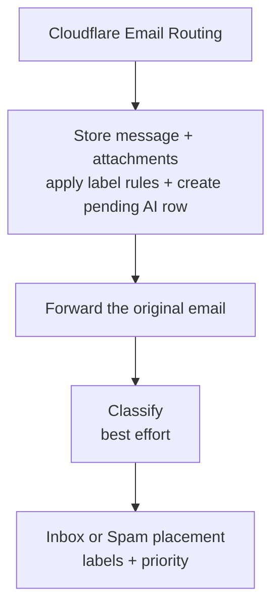
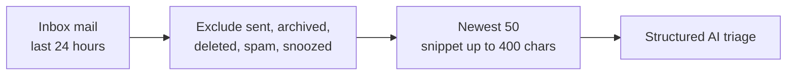
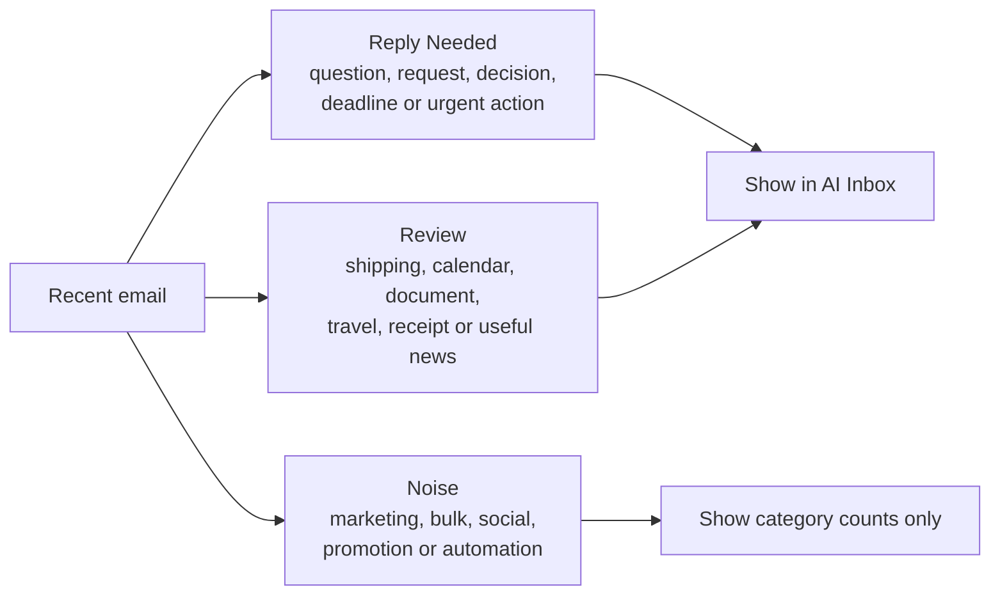

Cookie's AI features are deliberately narrow: each one assists a specific, familiar task rather than acting autonomously on the user's behalf. The full design rationale lives in Cookie-Web's `docs/AI-CAPABILITIES-REPORT.md`; this page explains what's shipped and how the pieces work together.

| Capability | Component | Model/API |
| --- | --- | --- |
| Auto-tagging | `mail-app-ingest` (Cookie-Worker) | OpenAI structured response |
| Spam detection | `mail-app-ingest` (Cookie-Worker) | Same structured response as auto-tagging |
| Federated search (mail, documents & tasks) | `cookie-web-search` (Cookie-Worker) | Meilisearch hybrid/federated search |
| Mailbox Q&A | `cookie-web-search` (Cookie-Worker) | OpenAI Responses API |
| AI Compose | `cookie-web-ai` (Cookie-Worker) | OpenAI Responses API |
| Reading-view summaries | `cookie-web-ai` (Cookie-Worker) | OpenAI Responses API |
| Natural-language calendar drafts | `cookie-web-calendar` (Cookie-Worker) | OpenAI Responses API |
| Link-only unsubscribe assistance | `cookie-web-messages` (Cookie-Worker) | OpenAI Responses API |
| AI Today: inbox triage | `data-enricher` (Cookie-Worker) | OpenAI Responses API |

## What “AI Inbox” means

AI Inbox is Cookie's normal mailbox with assistance layered around it — not a second mailbox and not an autonomous email agent. New inbound mail is classified automatically; summaries, mailbox Q&A, and draft generation run only when the user asks for them. Nothing in the AI path replies, sends, or deletes mail by itself.

| When | What runs | Result |
| --- | --- | --- |
| When mail arrives | Deterministic label rules, AI classification, spam scoring, and priority | Labels and Spam placement update; the message becomes available to search |
| When the user asks | Search, mailbox Q&A, a thread summary, or AI Compose | A result or draft is returned to the authenticated client |
| Saved schedule or on refresh | AI Today triage | Recent-inbox triage is stored for AI Today; news and task extraction do not run |

## What happens when mail arrives

### 1. Store first, with deterministic rules

`mail-app-ingest` parses the message and stores it idempotently through Hyperdrive. The same database transaction creates a durable `message_ai` row with `status = 'pending'` and evaluates the user's enabled conditions rules.

Conditions rules are deliberately separate from AI: they compare `subject`, `body`, `from`, or `to` using exact `contains`, `equals`, `starts_with`, or `ends_with` conditions. A matching rule writes a label with `source = 'rule'` (or marks the message done); because this happens inside the storage transaction, there is no confidence threshold or recovery job.

A rule can instead be defined by a plain-language prompt (`label_rules.kind = 'ai'`, migration `0068`), such as "receipts and order confirmations from online shops". Those prompts are not evaluated here: the classifier in step 3 receives them alongside the auto-tag labels and reports which rules the message matches, with the same 0.70 confidence bar. A matched AI rule applies its label with `source = 'ai'` and `rule_id` provenance, or marks the message done.

The original email is then forwarded to the real mailbox. Delivery is the primary outcome: storage, attachment upload, AI, and monitoring failures never intentionally make the model a dependency of forwarding.

### 2. Classify the message

Best-effort enrichment uses a fresh database client rather than holding the ingest connection open during model latency. It runs a single classification request, and the result is saved once the model responds.

The classification request contains:

- the sender address, subject, and up to **12,000 characters** of plain-text body;
- only user labels whose **Auto-tag** switch is enabled, including each label's ID, name, and description;
- a system instruction that treats the email as untrusted data, never as instructions.

The OpenAI response is constrained to a strict JSON schema containing candidate label IDs and confidences, a spam verdict/score/reason, and a `low`/`normal`/`high` priority. The default model is `gpt-5.6-luna` (overridable with `AI_MODEL`), and the stored prompt version is `email-enrichment-v2`.

:::note
Arrival-time enrichment never generates a message summary. Reading-view summaries are a separate, authenticated, user-triggered operation.
:::

### 3. Apply local policy after the model responds

Cookie-Worker does not write the model response directly. It applies deterministic checks first:

| Model output | Local decision | Effect |
| --- | --- | --- |
| Label candidates | Keep only IDs offered to the model with confidence **≥ 0.70** | Replace prior `source = 'ai'` labels; preserve manual and rule-applied labels |
| A `spam` verdict below **0.80** | Treat as Inbox | No automatic move |
| A `spam` verdict from **0.80** to below **0.98** | Store as internal `review` | Message remains in Inbox |
| A `spam` verdict **≥ 0.98** | Confirm as Spam | Apply the system Spam label, hide from Inbox and unread counts, show under **More → Spam** |
| `low` / `normal` / `high` priority | Store on `message_ai` | Used for mailbox priority; AI Today no longer runs per-email task extraction |

Every completed classification stores the provider, model, prompt version, processing time, spam reason, and label confidence. That provenance makes later prompt/model changes auditable. A retry deletes and rebuilds only AI-applied labels, so manual labels and deterministic rule results remain intact.

### 4. Recover partial failures

The `message_ai` row records `pending`, `completed`, or `failed` state. Every 15 minutes, `mail-app-ingest` selects up to three of the oldest rows that have been stale for at least two minutes and still need classification, and retries it.

Recovery never re-forwards a message and never changes the fact that it was delivered. It only repairs the optional AI layer.

### 5. User controls and current limits

In **Settings → Labels**, the user can enable or disable Auto-tag independently for each user label. Descriptions help the classifier distinguish similarly named labels, while manual labels and deterministic rules remain available when Auto-tag is disabled.

In **Settings → Rules**, a rule's matcher is either conditions or a Cookie AI prompt ("Match by"). Prompt rules describe the mail in plain language and can apply a label or mark mail done; they run with AI auto-tagging rather than at storage time, so they inherit its confidence threshold and retry sweep.

Spam is stored, not deleted, and the high threshold deliberately favours false negatives over hiding legitimate newsletters or receipts. There is not yet a **Not spam** feedback action, sender allow-list, or training loop; those are not implied by the AI Inbox label.

## Search and mailbox Q&A

`GET /search`, served by the `cookie-web-search` Worker, queries Meilisearch directly. Without `scope`, it preserves the mail-only response contract; `scope=all|mail|documents|tasks` runs the unified search page's federated query. Meilisearch blends keyword and semantic matches via its `semanticRatio`, so Cookie no longer computes embeddings or fuses ranked lists in application code. Mail filters (`tag:`, `sender:`, `to:`, `has:attachment`, `before:`, `after:`, `in:`), document tags/starred state, and incomplete task documents are applied per index. Subtask titles are indexed with their top-level task. Header typing and Enter both use hybrid search; explicit `mode=keyword` requests set `semanticRatio: 0`. Mail searches include archived messages by default and exclude deleted messages, while explicit `in:` filters retain their folder-specific behavior. Mail ranking uses recency only as the final relevance tie-breaker, tighter typo matching, and a 0.5 ranking-score threshold for text queries (not filter-only queries). Meilisearch is a hard dependency: an outage returns an error instead of falling back to Postgres.

`POST /ask`, also served by the `cookie-web-search` Worker, retrieves owned mailbox context from Meilisearch and asks the model to answer with cited messages. The retrieval and answer endpoints are Auth0-protected and rate-limited; retrieved message content is loaded server-side rather than accepted from the client.

## Reading-view summaries

`POST /summarize` on `cookie-web-ai` accepts only an owned message ID. The Worker resolves the complete thread server-side, orders it chronologically, and sends a bounded transcript to the Responses API. The current limits are 50 messages per thread, 20,000 body characters per message, and 100,000 characters for the assembled transcript; an oversized thread is rejected rather than silently summarized from partial context.

The resulting summary is saved to the selected message's `message_ai.summary` field and restored when the reader is reopened. The upsert changes only the summary, so it cannot overwrite classification status, spam state, priority, or provenance.

## AI Compose

`POST /compose` on `cookie-web-ai` accepts a user instruction, the current composer state, and an optional owned message ID for reply context — it fetches that context server-side rather than trusting whatever the browser sends. It returns a subject/body draft only:

:::note
Generation never calls Resend. The user must explicitly review, edit, and send the draft through the normal send path — in both Cookie-Web and Cookie-iOS.
:::

## AI Today

Read through `cookie-web-tasks`'s `GET /tasks`; only inbox triage is rebuilt by `data-enricher`:

- **Suggested to-dos** — Cookie's own Tasks due today or overdue (the same `task_items` the Tasks app edits, served by `cookie-web-tasks`) plus previously extracted action items from important mail, most-pressing first. The enricher no longer extracts new tasks. Completing or rescheduling one here updates it in the Tasks app.
- **Email triage** — recent Inbox mail divided into **Reply Needed**, **Review**, and **Noise**, rebuilt on the saved Europe/London schedule (default hourly, 09:00–19:00 daily) or on demand.
- **News round-up** — existing stored snapshots remain readable. The enricher no longer fetches feeds, ranks news, or writes fresh news snapshots.

`POST /tasks/refresh` calls `data-enricher`'s `POST /run?phase=today` over the `ENRICHER` service binding, carrying the shared trigger token and enforcing the configured owner before the triage-only rebuild. The legacy `digest` alias and a request without a phase also run only triage. News and per-email task extraction are excluded from every trigger.

## Calendar interpretation

`POST /calendar-events` with `action: "interpret"` turns natural language plus an IANA time zone into a bounded event draft. The browser or iOS client must show and explicitly submit that draft in a second create request; interpretation alone never writes a calendar row. The route shares the durable per-user AI rate limit.

## Link-only unsubscribe assistance

`cookie-web-messages` prefers RFC one-click and `mailto:` unsubscribe mechanisms. For a sender that exposes only a web page, the optional AI tier reads sanitized, size-bounded page HTML, proposes at most one form submission, and judges the returned page for a clear confirmation. Page text is untrusted: code validates the public HTTPS target, redirect chain, related host, fields, values, byte limits, and end-to-end deadline before the model's proposal can cause a request. Login, CAPTCHA, JavaScript-only, or ambiguous flows stop without claiming success.

### How email triage chooses what to show

Cookie adapts the policy from [Eric Porres's Email Triage Plugin](https://github.com/ericporres/email-triage-plugin). The plugin is a Claude/Gmail workflow, so Cookie does not install or execute it in production. `data-enricher` implements its useful decision rules directly with Cookie's existing OpenAI structured-response and Postgres pipeline.

The candidate scan is intentionally based on time, not unread state. Opening an email is not proof that its request has been dealt with.

For each candidate the model receives the sender, delivery address, subject, timestamp, and a bounded snippet. The delivery address can reveal an alias or role address; when it does not, the decision falls back to sender and content. Full bodies and threads are not loaded for this background scan.

The model must place every supplied message ID into exactly one tier:

- **Reply Needed** shows a one-line summary and a suggested next action.
- **Review** shows why the message deserves attention even when no reply is needed.
- **Noise** never becomes an email row. Cookie counts it locally by category and shows only the summary.

Cookie validates the response after the model call. An unknown ID, duplicate ID, or missing candidate rejects the triage run instead of silently hiding mail. The stored record keeps the legacy `daily_digest` kind and `topics` field so Cookie-Worker and Cookie-Web remain safe to deploy in either order; it also records `email-triage-v1` and the policy source for provenance.

Triage is a view, not a mailbox mutation. It never sends, archives, or deletes anything. Cookie-Web rechecks cited message IDs against live mailbox state before rendering and drops messages deleted since the snapshot; clicking **Mark all emails as read** is still an explicit user action.

## Safety boundaries

- **Forwarding first**: in `mail-app-ingest`, storage, classification, and monitoring failures never intentionally block mail delivery.
- **Server-trusted context**: AI Compose and reply context are fetched server-side, never trusted from the client.
- **Constrained egress**: AI unsubscribe can submit only a validated form to a related public HTTPS host; arbitrary model-selected requests are rejected.
- **Bounded automation**: AI never sends or deletes mail. Only a spam verdict at or above `0.98` changes folder placement automatically; each label's `auto_apply` setting independently controls whether AI may apply it.
- **Rate limits**: `0039_api_rate_limits.sql` gives AI and enricher requests durable, per-user Postgres counters shared across serverless instances — see [Data model](/data-model#rate-limits).
- **Sanitised error reporting**: `mail-app-ingest` reports failures to Sentry without email or model content (`sentry.js`).
